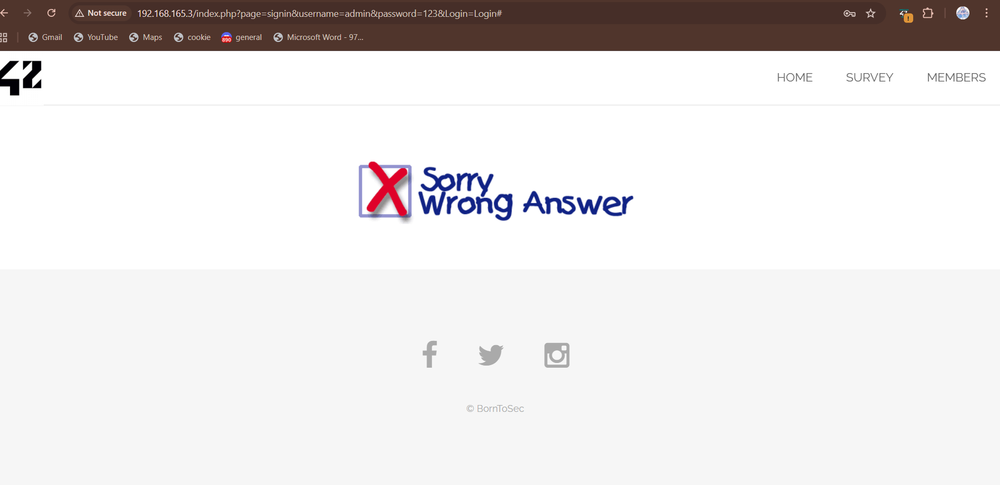

# Sign In Brute Force

## Discovery

Clicking the "SIGN IN" button on the main page takes us to a login form with two input boxes. We tried some random credentials like `login: admin` and `password: 123` and got redirected to a "wrong answer" page.

Looking at the URL, we noticed it contains the login attempt in the query string: `username=admin&password=123`. Hence, we can just brute force it by just modifying the URL username and password parameters and sending a request with the same url.

## Brute Force Attack

We took common usernames and passwords from [SecLists github](https://github.com/danielmiessler/SecLists) and wrote a Python script to try every combination automatically.

After running the script, turns out any username paired with the password `shadow` works and gets you in.