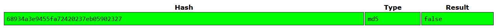
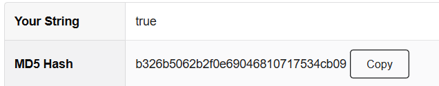

# Cookie Tampering

[OWASP Cookie Tampering Documentation](https://owasp.org/www-project-web-security-testing-guide/latest/4-Web_Application_Security_Testing/06-Session_Management_Testing/01-Testing_for_Session_Management_Schema#cookie-reverse-engineering)

## Finding the Cookie

By opening dev tools and checking the cookie section, we discover the one and only cookie called `I_am_admin` with an MD5 hashed value. Decoding the hashed value gives:

This shows that the backend just checks this cookie to see if we're admin. Since cookies are stored client-side, we can just change it ourselves.

## Getting the Flag

To get the flag, we just replace the current cookie with a generated MD5 hash of "true", and refresh the page

