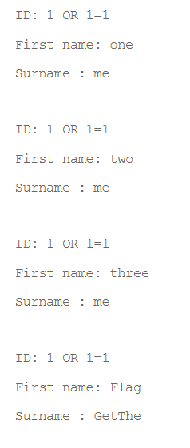
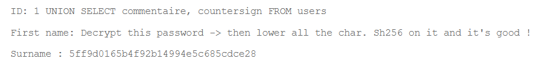
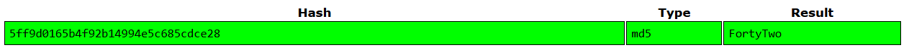
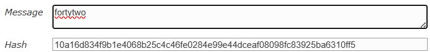

# SQL Injection Vulnerability Exploitation

While exploring the members page, I found an input box in the members page, I submitted an empty value returned a MariaDB error message:
```
You have an error in your SQL syntax; check the manual that corresponds to your MariaDB server version for the right syntax to use near '' at line 1
```

This error confirmed that user input was being directly inserted into SQL queries without proper sanitization.

## 1 - Understanding the Query Structure

When entering `1` into the input box, the page displayed:
```
ID: 1
First name: one
Surname: me
```

This revealed that the backend executes a query similar to:
```sql
SELECT [firstname_column], [surname_column], ... FROM [user_table] WHERE [id_column]=[input]
```

## 2 - Extracting All Records

To retrieve all entries from the database, I injected `1 OR 1=1`, which modified the query to:
```sql
SELECT [firstname_column], [surname_column], ... FROM [user_table] WHERE [id_column]=1 OR 1=1
```

This returned all names in the database:



The output showed 4 users, with the last entry displaying "Get the flag" as the surname, indicating a hidden flag in the database.

## 3 - Determining Column Count

To use `UNION SELECT` attacks, I needed to determine how many columns the query returns. I tested incrementally:
```sql
1 UNION SELECT 1
1 UNION SELECT 1,2
```

The query `1 UNION SELECT 1,2` succeeded, confirming the query returns exactly 2 columns.

## 4 - Discovering Table Names

[Mariadb information schema TABLES documentation](https://mariadb.com/docs/server/reference/system-tables/information-schema/information-schema-tables/information-schema-tables-table)

Using MariaDB's `information_schema.tables`, all table names can be found using the query:
```sql
1 UNION SELECT 1, table_name FROM information_schema.tables
```

Scrolling through the results revealed the target table was named `users`.

## 5 - Identifying Column Names

[Mariadb information schema COLUMNS documentation](https://mariadb.com/docs/server/reference/system-tables/information-schema/information-schema-tables/information-schema-columns-table)

Next, I used `information_schema.columns` to discover all columns in the `users` table:
```sql
1 UNION SELECT table_name, column_name FROM information_schema.columns
```

The results showed the `users` table contained columns including `first_name`, `last_name`, `town`, ... `Commentaire`, and `countersign`.

## 6 - Extracting Column Data

I then extracted data from each column using:
```sql
1 UNION SELECT [col1], [col2] FROM users
```

After analyzing each column, I found the encrypted flag hidden in the `Commentaire` and `countersign` columns of the last user entry:



## 7 - Getting the flag

The extracted value was a 32-character hexadecimal string, indicating MD5 encryption. Using an MD5 decryption tool revealed the plaintext:



Following the instructions, I converted the decrypted string to lowercase and encoded it using SHA-256 to obtain the final flag:

