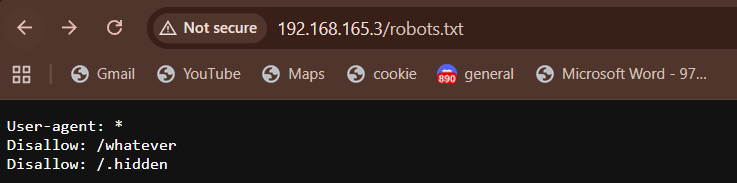
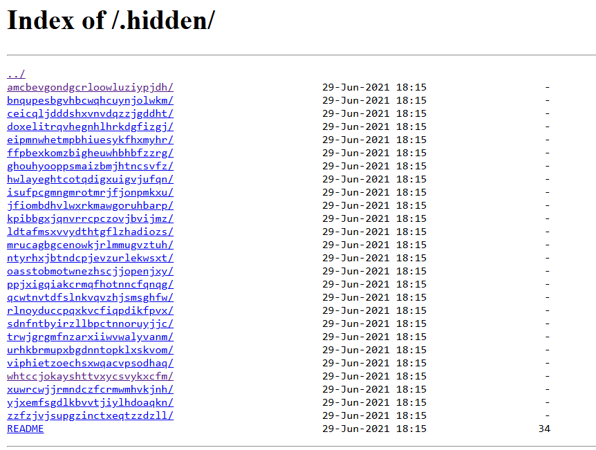

# Web Scraping - robots.txt & Hidden Directories

## Finding the Hidden Directory

[OWASP Documentation on Reconnaissance for Information Leakage](https://owasp.org/www-project-web-security-testing-guide/latest/4-Web_Application_Security_Testing/01-Information_Gathering/01-Conduct_Search_Engine_Discovery_Reconnaissance_for_Information_Leakage)

Most websites have a `robots.txt` file that tells web crawlers and search engine bots which parts of the site they're allowed to access. By checking `http://192.168.165.3/robots.txt`, we can see what the site is trying to hide from crawlers.

The robots.txt reveals a `/.hidden/` directory that's disallowed for bots. We can access it directly at `http://192.168.165.3/.hidden/`

## Transversing

The `.hidden/` directory contains a lot of subdirectories, which also contains alot of subdirectories, each with random names. Each subdirectory has its own README file, and most of them just contain troll messages. Hence, a Python script is written that recursively crawls through all the subdirectories and checks every README for the flag. 